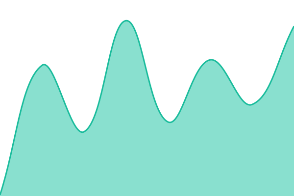
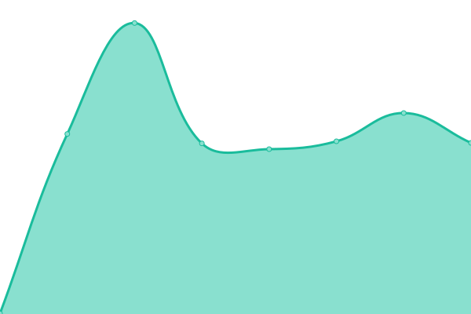

# [📈 Live Status](https://status.sunnypilot.ai): <!--live status--> **🟩 All systems operational**

This repository contains the open-source uptime monitor and status page for [sunnypilot](https://status.sunnypilot.ai), powered by [Upptime](https://github.com/upptime/upptime).

With [Upptime](https://upptime.js.org), you can get your own unlimited and free uptime monitor and status page, powered entirely by a GitHub repository. We use [Issues](https://github.com/sunnypilot/status-page/issues) as incident reports, [Actions](https://github.com/sunnypilot/status-page/actions) as uptime monitors, and [Pages](https://status.sunnypilot.ai) for the status page.

<!--start: status pages-->
<!-- This summary is generated by Upptime (https://github.com/upptime/upptime) -->
<!-- Do not edit this manually, your changes will be overwritten -->
<!-- prettier-ignore -->
| URL | Status | History | Response Time | Uptime |
| --- | ------ | ------- | ------------- | ------ |
|  [sunnypilot](https://www.sunnypilot.ai) | 🟩 Up | [sunnypilot.yml](https://github.com/sunnypilot/status-page/commits/HEAD/history/sunnypilot.yml) | 

 504ms
     
 | 

<a href="https://status.sunnypilot.ai/history/sunnypilot">100.00%</a>
    

|  [sunnylink](https://www.sunnylink.ai) | 🟩 Up | [sunnylink.yml](https://github.com/sunnypilot/status-page/commits/HEAD/history/sunnylink.yml) | 

 160ms
     
 | 

<a href="https://status.sunnypilot.ai/history/sunnylink">100.00%</a>
    

|  [sunnypilot Community Forum](https://community.sunnypilot.ai) | 🟩 Up | [sunnypilot-community-forum.yml](https://github.com/sunnypilot/status-page/commits/HEAD/history/sunnypilot-community-forum.yml) | 

 2500ms
     
 | 

<a href="https://status.sunnypilot.ai/history/sunnypilot-community-forum">99.36%</a>
    

|  [clippy](https://clippy.royjr.com) | 🟩 Up | [clippy.yml](https://github.com/sunnypilot/status-page/commits/HEAD/history/clippy.yml) | 

 437ms
     
 | 

<a href="https://status.sunnypilot.ai/history/clippy">94.79%</a>
    

<!--end: status pages-->

[**Visit our status website →**](https://status.sunnypilot.ai)

## 📄 License

- Powered by: [Upptime](https://github.com/upptime/upptime)
- Code: [MIT](./LICENSE) © [Anand Chowdhary](https://anandchowdhary.com), supported by [Pabio](https://pabio.com)
- Data in the `./history` directory: [Open Database License](https://opendatacommons.org/licenses/odbl/1-0/)
